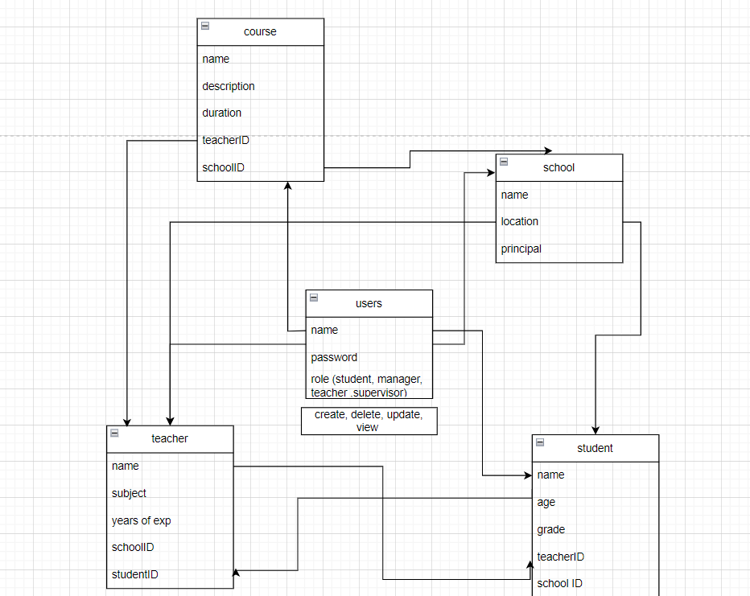

# api-auth-app v01

**[Deployed link](https://api-auth-app-ewln.onrender.com/)**
**[Actions](https://github.com/ramaalmomani1/api-auth-app/actions)**
**[PR](https://github.com/ramaalmomani1/api-auth-app/pulls)**

----
## App description:

This app is a server-side application, school management system app that utilizes Sequelize to define and manage the relationships between various models representing schools, teachers, students, courses, and user data.

 ----

 ## Relations description:

1. SchoolModel.hasMany(TeacherModel):

* A school can have multiple teachers.
* This establishes a one-to-many relationship where a school is associated with multiple teachers.

2. SchoolModel.hasMany(StudentModel):

* A school can have multiple students.
* This establishes a one-to-many relationship where a school is associated with multiple students.

3. SchoolModel.hasMany(CourseModel):

* A school can offer multiple courses.
* This establishes a one-to-many relationship where a school is associated with multiple courses.

4. TeacherModel.belongsTo(SchoolModel):

* A teacher belongs to a school.
* This establishes a one-to-one relationship where a teacher is associated with a specific school.

5. TeacherModel.hasMany(StudentModel):

* A teacher can have multiple students.
* This establishes a one-to-many relationship where a teacher is associated with multiple students.

6. TeacherModel.hasMany(CourseModel):

* A teacher can teach multiple courses.
* This establishes a one-to-many relationship where a teacher is associated with multiple courses.

7. StudentModel.belongsTo(SchoolModel):

* A student belongs to a school.
* This establishes a one-to-one relationship where a student is associated with a specific school.

8. StudentModel.belongsToMany(TeacherModel, { through: "TeacherStudent" }):

* A student can have multiple teachers, and a teacher can have multiple students.
* This establishes a many-to-many relationship where a student is associated with multiple teachers, and a teacher is associated with multiple students through the "TeacherStudent" join table.

9. StudentModel.belongsToMany(CourseModel, { through: "StudentCourse" }):

* A student can be enrolled in multiple courses, and a course can have multiple students.
* This establishes a many-to-many relationship where a student is associated with multiple courses, and a course is associated with multiple students through the "StudentCourse" join table.

10. CourseModel.belongsTo(SchoolModel):

* A course belongs to a school.
* This establishes a one-to-one relationship where a course is associated with a specific school.

11. CourseModel.belongsTo(TeacherModel):

* A course is taught by a specific teacher.
* This establishes a one-to-one relationship where a course is associated with a specific teacher.

12. CourseModel.belongsToMany(StudentModel, { through: "StudentCourse" }):

* A course can have multiple students, and a student can be enrolled in multiple courses.
* This establishes a many-to-many relationship where a course is associated with multiple students, and a student is associated with multiple courses through the "StudentCourse" join table.

---- 

### UML:

